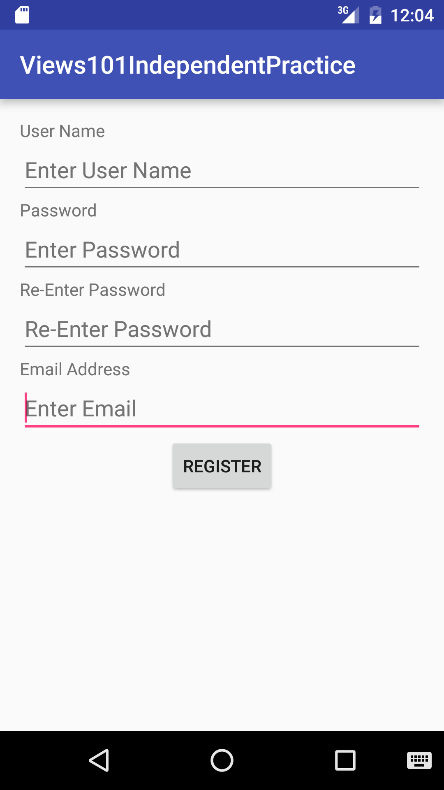

title | type | duration | creator
----- | ---- | -------- | -------
Views 101 | lesson | 1:30 | James Davis (New York)

--

<!-- OUTSTANDING ITEMS

1. Prepare a screenshot of the source code displayed in the section "Introduction: Layouts and XML"
2. Exact directions for last independent practice and guided practice
3. Checks

-->

#  Views 101

### Objectives
*After this lesson, students will be able to:*

* Identify what a view is and what it’s used for
* Match sections of the view XML to what’s on the screen

### Preparation
*Before this lesson, students should already be able to:*

- Create or import a project in Android Studio


## Opening (5 minutes)

We all use apps every day on our phones, but we often don't think about how they are designed. There is a lot of thought that goes into how everything on the screen looks, and how it is organized. Today we're going to be exploring the basics of how the user interface is built in Android.


## Introduction: Views (15 minutes)

#### What is a view?

A **View** is the basic building block for any app's user interface (UI). Views define components that can be seen by the user, such as text fields, buttons, and images.

<a href="screenshots/tweet-screenshot.png"></a> <a href="screenshots/tweet-screenshot_highlighted.png"></a>

*(Left) A screen in Twitter, (Right) the same screen with common views highlighted*

#### What are the types of views?

Some of the most commonly used views are:

* TextView
* EditText
* Button
* ImageView
* CheckBox and Switch
* ProgressBar
* WebView

#### TextViews

Simply, they display text that's provided to them. You can change the text, text color, typeface, size, etc. Think of it like changing fonts in a word processor.

#### Buttons

Buttons are fancy TextViews. Just like a TextView, you can set its text and change its font attributes.

Buttons, by default, have a background that react to a user's touch. (i.e., it looks like you are pressing a physical button). You can create your own custom button backgrounds. That is covered in a future lesson.

#### How are views laid out on screen?

* A ViewGroup defines how other views are shown on screen.
* There is a parent/child relationship. ViewGroups are parent views that contain its children views.
* **RelativeLayout** arrange views relative to each other. Examples:
	* This TextView is below this ImageView
	* This Button is to the right of another button
	* This ImageView is centered, relative to the RelativeLayout itself.

*For the purposes of this lesson, we will only look at RelativeLayout. We talk about the other view groups more in depth in the Layouts lesson.*


## Guided Practice: Let's draw a few Layouts (10 minutes)


In pairs, on your desks, draw and identify the basic layouts using the views we just learned for the following activities:

* A post on Facebook or Twitter
* A post on Facebook (with a picture)
* The description on a YouTube video

You should have an idea of popular layouts for popular applications.


## Introduction: Layouts and XML (20 minutes)

#### How do I create my own views and view groups?

The easiest way to create views are in layout files and those are are XML files. Every element defines the different types of views and view groups. Attributes define how the views and view groups are displayed to the user.

Here's an example of how a text view is represented in xml:

```xml
<TextView
        android:id="@+id/textView"
        android:layout_width="wrap_content"
        android:layout_height="wrap_content"
        android:text="Hello World!" />
```

Elements that aren't the parent of other views, like TextView, can be defined as empty tags.  Most attributes are in the XML namespace, "android:". This denotes default attributes provided by Android.


Every element ***is required*** to have **layout_width** and **layout_height** attributes. Otherwise, the app would not run.

`layout_width` and `layout_height` can be defined in 3 ways:

* An exact dimension, in pixels (talked about in depth in Views 102)
* **wrap_content**, where it takes up only the amount of space it needs. For instance, with a TextView, setting its width to wrap_content makes it as wide as its text.
* **match_parent**. Remember, view groups are considered parents. Using this makes the width or height match the parent's width or height, respectively.

The **id** attribute is not mandatory, but is important. It is used whenever you want to reference a view or view group, either in that layout or in Java.

Here's a more detailed example of a full xml layout:

```xml
<?xml version="1.0" encoding="utf-8"?>
<RelativeLayout xmlns:android="http://schemas.android.com/apk/res/android"
    android:layout_width="match_parent"
    android:layout_height="match_parent">

    <TextView
        android:id="@+id/textView1"
        android:layout_width="wrap_content"
        android:layout_height="wrap_content"
        android:layout_centerHorizontal="true"
        android:text="Top" />

    <TextView
        android:layout_width="wrap_content"
        android:layout_height="wrap_content"
        android:layout_below="@+id/textView1"
        android:layout_centerVertical="true"
        android:text="Bottom"
        android:textSize="20sp"
        android:textColor="#000000"
        android:textStyle="bold" />

</RelativeLayout>

```


In this example, take note of the following:

* The layout is defined as a RelativeLayout that is the width and height of the device's screen
* The RelativeLayout is the parent of two children: Two TextViews
* The top TextView, with id "textView1", is centered horizontally in the relative layout. It's width and height wraps around its text, "Top".
* The bottom TextView, with no id, is also centered horizontally in the relative layout. It's width and height wraps around its text, "Bottom".

	* Because it is a TextView, it also defines its optional parameters: text size is 20 scaled pixels (Views 102), text color is the hex code for black, and the text style is bold.
	* Because its parent is a RelativeLayout, the text view can be placed relative to other views. In this case, it is directly below the view with id "textView1".

	> Check: Ask the students what two values are required for all Views, and what two common pre-defined values are usually used for them.

## Guided Practice: Let's program some layouts (15 minutes)

Let's go over adding views and layouts in Android Studio. We will start off dragging views in the Android Studio Designer Tool, then switch over to the XML view to see how they are related. Then, we will add views via xml and see how the look in the preview.

We're going to create a login form with two TextViews, two EditTexts, and a button. We will add the first TextView and EditText with the designer tool, and the rest through XML.


## Independent Practice: Create your own layouts (20 minutes)


Provided the screenshot below of a simple view in an Android app, the teams will try to create the view on their own.




## Conclusion (5 mins)

Hopefully you're starting to learn the basic types of Views in Android. Knowing how to combine views to make your apps in XML can be tough to learn at first, but it will give you a much better understanding of the details of each kind of view. Let's review the following topics:

- What is a view?
- What is a view group?
- How does a RelativeLayout work?
