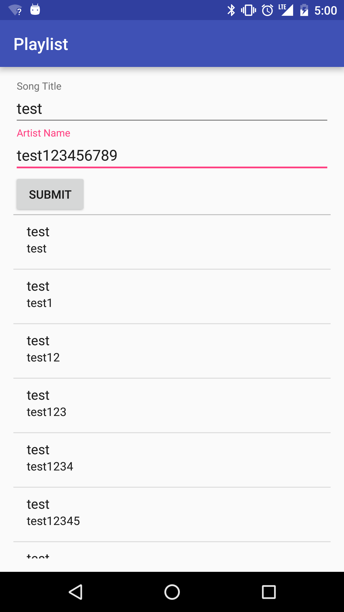

# Organizing Information - Playlist

## Introduction

> ***Note:*** _This can be a pair programming activity or done independently._

In this lab, you will be writing an app that manages a playlist using Lists. You will have two parallel lists, one containing the songs, and another the corresponding artists. **No duplicates are allowed!** You will type the information into text boxes, click an add button, and they will be added to the list below. Tapping on the list item will remove it from the list.

## Exercise

#### Requirements

- Allow the user to add songs and artists to a playlist
- Allow the user to remove songs and artists from a playlist
- Must contain no duplicate entries
- Data must be stored in two parallel Lists, one for artists, the other for songs.

**Bonus:**
- Implement a song limit for the playlist
- Add a third piece of information, a star rating (0-5), and figure out how to display it on the list items

#### Starter code

In the `starter-code` folder, you will find a project that has the input flow and basic ListView set up for you. The focus of this lab is on organizing the data, so that will be your main responsibility. Look for the TODO comments in the code for specific instructions.

#### Deliverable

The screenshot below shows how the app should look with data filled out.

  

## Additional Resources

- [Oracle Docs on Lists](https://docs.oracle.com/javase/8/docs/api/java/util/List.html)
- [Android Docs on ListViews](http://developer.android.com/reference/android/widget/ListView.html)
