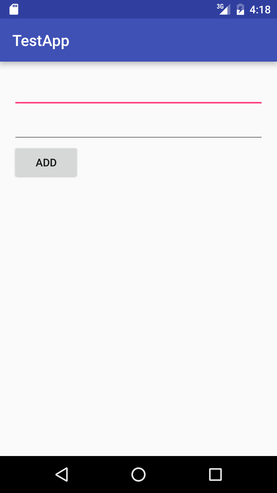
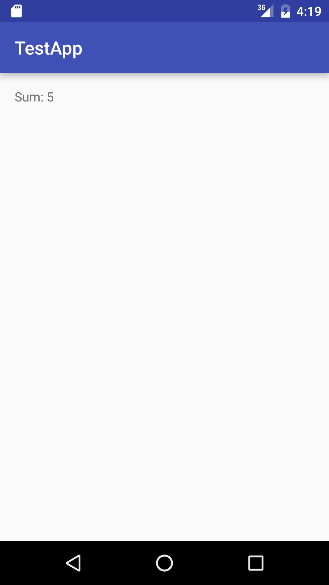

title | type | duration | creator
----- | ---- | -------- | -------
Activities and Intents | lesson | 1:20 | James Davis (New York)

--

<!-- OUTSTANDING ITEMS

1. Prepare a screenshot of the source code displayed in the section "Introduction: Layouts and XML"
2. Exact directions for last independent practice and guided practice
3. Checks

-->

#  Activities and Intents

### Objectives
*After this lesson, students will be able to:*

* Given a running application, identify the activities in that application
* Identify the same activities in the app manifest
* List the intents required to move between these activities (introduces Intents)
* Given a code fragment that creates an intent, describe what the code does

## Introduction: What is an Activity? What is a Manifest (15 mins)

Most of the time, you can think of an Activity as a screen of your app.


The definition of an activity is something that is done for a particular purpose.

Think about the activity that the user is doing on a screen. If you are looking at a screen whose purpose is to log in the user, for example, it should be called the Login Activity. If the activity shows a user's social network profile , it should be called the User Profile Activity.

#### What is a Manifest?

The dictionary defines a ship's manifest to be "a document giving comprehensive details of a ship and its cargo and other contents, passengers, and crew for the use of customs officers."

The ship, in our case, is the app you are building.


The Android Manifest xml file presents important information about your app to the Android system. If something isn't defined in the manifest, then the system just ignores it.

Notably, the manifest is known for describing the main components of your app; the Activities, Services, Content Providers, etc. It is also the place to define permissions (e.g., giving your app permission to access the internet or to access a device's camera).

Whenever you create a new Activity, if it is not automatically added, it should be added to the manifest. Otherwise, the app will crash.


An Activity is a plain ol' Java class, so you already know how to add it to a project.

Right click on the folder where you want to put the activity, then go to *New* > *Activity*, and then click on the type of base activity you want (usually, *Empty Activity* is what you want if you want to build it from scratch).

Doing this also adds the Activity to the Android Manifest.

## Demo: Creating Activities (10 mins)

In this demo, let's walk through the following:


* Creating a new project in Android Studio
* Examining the manifest file, describing components like the XML elements, attributes, and package
* Describe what a launcher activity is (The activity that opens when the app is launched), and make comparisons to Java's *public static void main* method
* Add 2 more activities to the project, and go back to the manifest and see them added

Note: A complete example of this is found in the [solution code folder](solution-code).


## Introduction: What are Intents? (10 mins)

Intent, as defined in the dictionary, means purpose, goal, objective. *Something intends to do some goal*.

This translates to your app and activities; every activity has a goal.

For example, a `ComposeEmailActivity` allows the user to compose and send an email. If you click a "compose new email" button, you are actively saying "I intend to compose an email".

This is the idea behind Intents in Android. Intents are messages you send between app components, like Activities, usually with the intent of doing something.

So, imagine you are in your app's `EmailListActivity`, and you click on one of your emails. The following "dialogue" is happening:

- EmailListActivity: Hey, you clicked one of your emails. What's up?
- You: I intend on reading that email. Is that okay?
- EmailListActivity: Yeah, sure! I'll start the ReadEmailActivity now.
- You: Thank you.

So, how does this look in code?

```java

	Intent intent = new Intent(EmailListActivity.this, ReadEmailActivity.class);
	startActivity(intent);

```

You create a new Intent object, and you pass it two parameters: The activity you are currently in, and the class of the activity you intend to start. The code snippet above could be read as, *From the Email List Activity, please start the Read Email Activity*.

The method, *startActivity()*, starts the intended activity immediately.

## Guided Practice: Starting an activity with an Intent (10 mins)

Using the code in the previous demo, add a button to the app's main activity. Set an onClickListener to that button and have the listener start one of the other activities. Run the app in a virtual device, and click on the button to start the new activity.

Note: A complete example of this is found in the [solution code folder](solution-code).

## Introduction: Sending data from one Activity to another Activity (10 mins)

Intents are how Activities communicate with each other. In the previous example, we started an activity to read an email by clicking an email in the list. However, how does the ReadEmailActivity know which email to show?

When you start a new activity, it is shown with the default settings that you give it. However, some activities need to receive a bit more information. This info is sent from the original activity to the one you are starting.

When creating new intents, you can also give it *extra* data. Here's an example:

```java

	Intent intent = new Intent(EmailListActivity.this, ReadEmailActivity.class);
	intent.putExtra("ID", 123);
	intent.putExtra("SENDER", "John Smith");
	startActivity(Intent);

```

The Intent class has a handful of helper methods you can call to get and store extra data. The main one is `putExtra()`, which takes two parameters: a String that gives the data a name, and the data itself.

With `Intent.putExtra()`, you can put data inside the intent (including Strings, numbers, booleans, certain objects).

Once you start a new activity, you can retrieve the Intent and get the sent data, as follows:

```java

	// get the intent that started this activity
	Intent intent = getIntent();

	// get the data from the intent
	int id = intent.getIntExtra("ID", 0);
	String sender = intent.getStringExtra("SENDER");

```

Again, the Intent class has a handful of getters for extra data, usually formatted like *get_____Extra*. Examples, `getIntExtra()`, `getStringExtra()`, `getBooleanExtra()`, etc.

Note: You should only send data if you need to do so. If the activity you are starting doesn't need extra data, you don't have to set it.

## Demo: Sending data between Activities (15 mins)


Let's go ahead and start a new Android project with a empty main activity. Add a new Activity, and call it `EchoActivity`.

In `MainActivity`, add an `EditText` and a Button. In the `EchoActivity`, it will just have a `TextView`.

In Java, set an `onClickListener` to the button and make it start the `EchoActivity`. The value of the `EditText` is passed in the intent.

In the `EchoActivity`, the value is plucked from the intent and put in the TextView.


#### Independent Practice: Add two numbers (15 mins)


* Create a new project, with an empty main Activity
* Create a new activity, call it SolutionActivity
* In the main activity, put two EditTexts and one button in the layout. The button's text will say "Add"
* In the solution activity, just have one TextView
* When the button is pressed, it takes the two values and sends them to the solution activity, where the sum of the two numbers are shown.




#### Conclusion (5 mins)
- What is an activity?
- What is an intent?
- How do we start an activity?
- How do we send data from one activity to another?

## Additional Resources

* Android Developer | Starting Activities - http://developer.android.com/guide/components/activities.html#StartingAnActivity
* Android Developer | Intents - http://developer.android.com/guide/components/intents-filters.html
